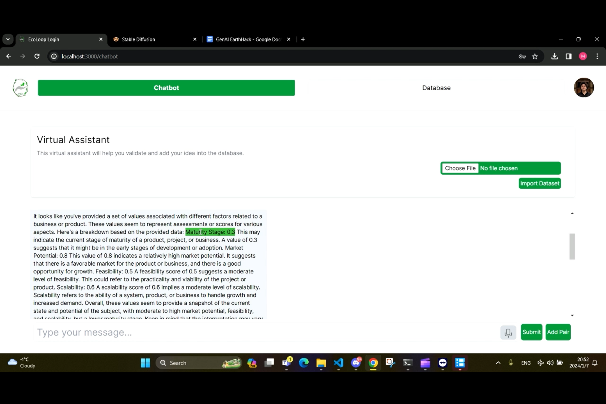
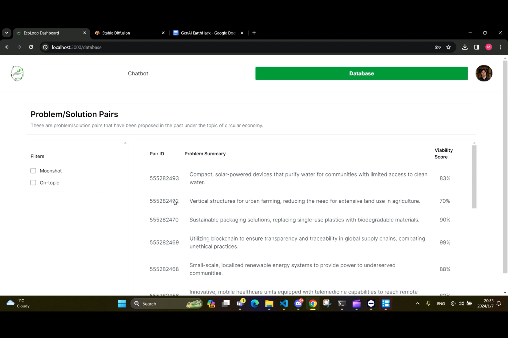
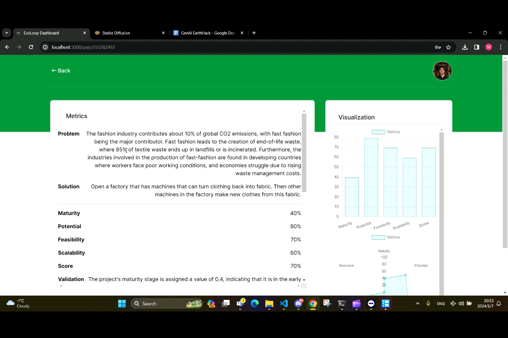
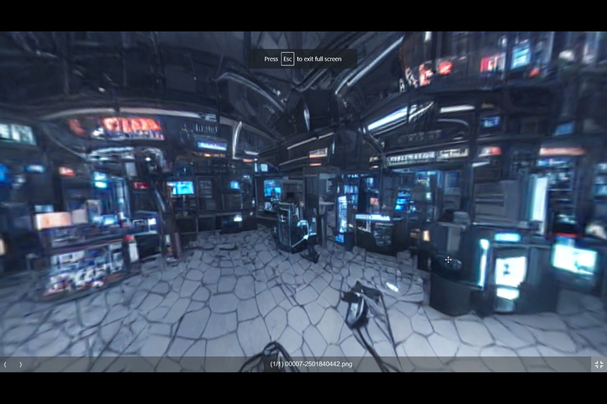

# EcoLoop

Welcome to EcoLoop, where innovation meets intelligence! EcoLoop redefines the idea evaluation landscape by seamlessly integrating generative AI, offering a dynamic platform that enhances decision-making with unparalleled insights. Evaluate innovative solutions effortlessly and efficiently with the power of EcoLoop.


## Getting Started

To embark on your EcoLoop journey, follow these simple steps:

1. Clone the repository to your local machine:

   ```bash
   git clone https://github.com/CaesarSaleh/ecoloop.git
Navigate to the backend folder and start the backend server:

bash
Copy code
cd ecoloop/backend
python main.py
Open a new terminal window, navigate to the ecoloop/frontend folder, and start the frontend website:

bash
Copy code
cd ecoloop/frontend
npm install
npm run dev
Open your web browser and go to http://localhost:3000 to delve into the EcoLoop Idea Evaluation App.

Features
Chatbot Interaction: Effortlessly articulate problem-solution pairs with an intuitive chatbot interface.

Visualizations: Gain profound insights through graphical representations, maturity stage, and viability scores.

3D-VR Integration: Immerse yourself in proposed solutions with realistic virtual reality experiences.








### Technologies Used:
Pinecone: Fast similarity search for vectorized data.
Language Model (LLM): Harness the power of generative AI for dynamic learning.
LORA Model: Generates the 3-d VR solution
Web Scraper: Gather comprehensive data on circular economy principles.
Semantic Classifier: Discern semantic meanings for effective idea categorization.
Semantic Summarizer: Summuraize content based on its meaning
Nextjs, TailWindCSS: The backbone technologies ensuring a seamless user experience.
Flask: Handles backend and endpoint creations, and runs the ML models

### Retrieval-Augment-Generator (RAG):
EcoLoop's intelligence is amplified by the Retrieval-Augment-Generator framework LangChain, creating a synergy between the Language Model and the vast knowledge repository encoded in the vector database. This ensures that EcoLoop evolves dynamically with every interaction, delivering nuanced and context-aware responses.


### Contributors:
Marshal Guo
Kuzey Ozterac
Caesar Saleh
Sohaila Ali

### License:
This project is licensed under the MIT License - see the LICENSE file for details.

Feel free to explore, contribute, and enjoy using the ChatBot NFT Minting and Selling App! If you have any questions or feedback, please don't hesitate to reach out to the project contributors.
